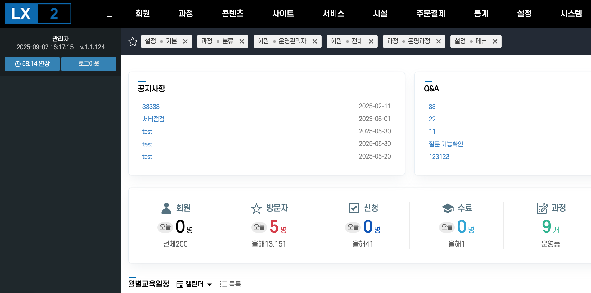

  

  <!-- 회원 -->
  

    

      

        

        
회원

      

      

        

          

            
전체

            <a href="회원-학습자.md">학습자</a>
            <a href="회원-교수자.md">교수자</a>
            <a href="회원-조교.md">조교</a>
            <a href="회원-소속담당자.md">소속 담당자</a>
            <a href="회원-운영관리자.md">운영관리자</a>
            
소속

            <a href="소속관리.md">소속관리</a>
          

          

            
문자알림

            <a href="문자알림-발송하기.md">발송하기</a>
            <a href="문자알림-발송내역.md">발송내역</a>
            <a href="문자알림-자주쓰는메시지.md">자주 쓰는 메시지</a>
          

        

      

    

  

  <!-- 과정 -->
  

    

      

        

        
과정

      

      

        

      

    

  

  <!-- 콘텐츠 -->
  

    

      

        

        
콘텐츠

      

      

        

          

            
학습

            <a href="학습-그룹.md">그룹</a>
            <a href="학습-콘텐츠.md">콘텐츠</a>
            
시험

            <a href="시험-출제그룹.md">출제그룹</a>
            <a href="시험-시험지.md">시험지</a>
            <a href="시험-문항.md">문항</a>
          

          

            
과제

            <a href="과제.md">과제관리</a>
            
설문

            <a href="설문-설문지.md">설문지</a>
            <a href="설문-문항.md">문항</a>
            
토론

            <a href="토론.md">토론관리</a>
          

        

      

    

  

  <!-- 사이트 -->
  

    

      

        

        
사이트

      

      

        

      

    

  

  <!-- 서비스 -->
  

    

      

        

        
서비스

      

      

        

      

    

  

  <!-- 시설 -->
  

    

      

        

        
시설

      

      

        

          

            
건물

            <a href="강의동.md">강의동</a>
            <a href="강의실예약.md">강의실 예약</a>
            <a href="스튜디오.md">스튜디오</a>
            <a href="스튜디오예약.md">스튜디오 예약</a>
          

          

        

      

    

  

  <!-- 주문결제 -->
  

    

      

        

        
주문결제

      

      

        

      

    

  

  <!-- 통계 -->
  

    

      

        

        
통계

      

      

        

      

    

  

  <!-- 설정 -->
  

    

      

        

        
설정

      

      

        

          

            
기본

            <a href="기본.md">기본</a>
            <a href="과정.md">과정</a>
            
보안

            <a href="보안-기본.md">기본</a>
            <a href="보안-API.md">API</a>
            <a href="메뉴.md">메뉴</a>
          

          

            
템플릿

            <a href="템플릿-수료증.md">수료증</a>
            <a href="템플릿-수강신청서.md">수강신청서</a>
            <a href="템플릿-썸네일.md">썸네일</a>
            <a href="템플릿-자동알림.md">자동알림</a>
            <a href="게시판.md">게시판</a>
            <a href="약관관리.md">약관 관리</a>
            <a href="그리드.md">그리드</a>
            <a href="언어.md">언어</a>
          

        

      

    

  

  <!-- 시스템 -->
  

    

      

        

        
시스템

      

      

        

      

    

  

